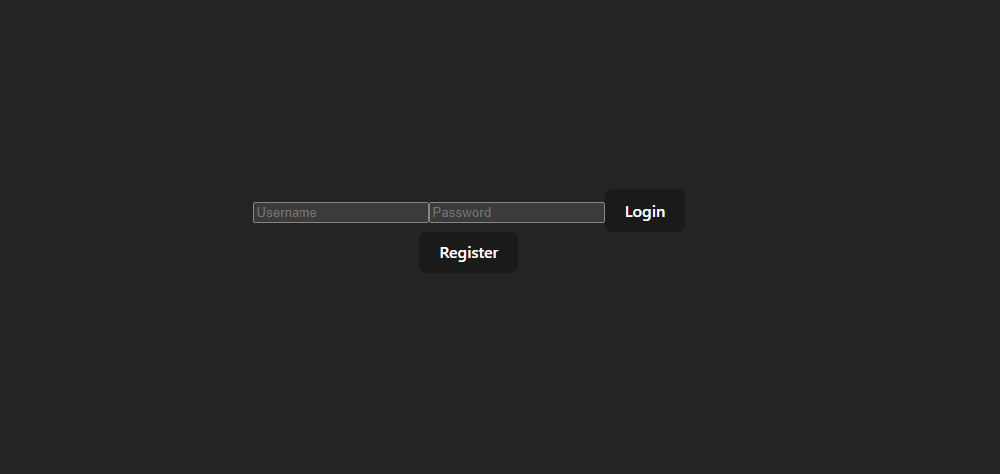
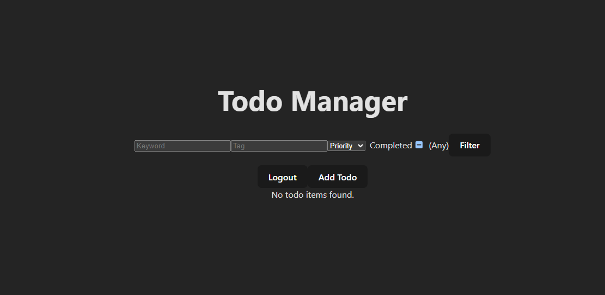
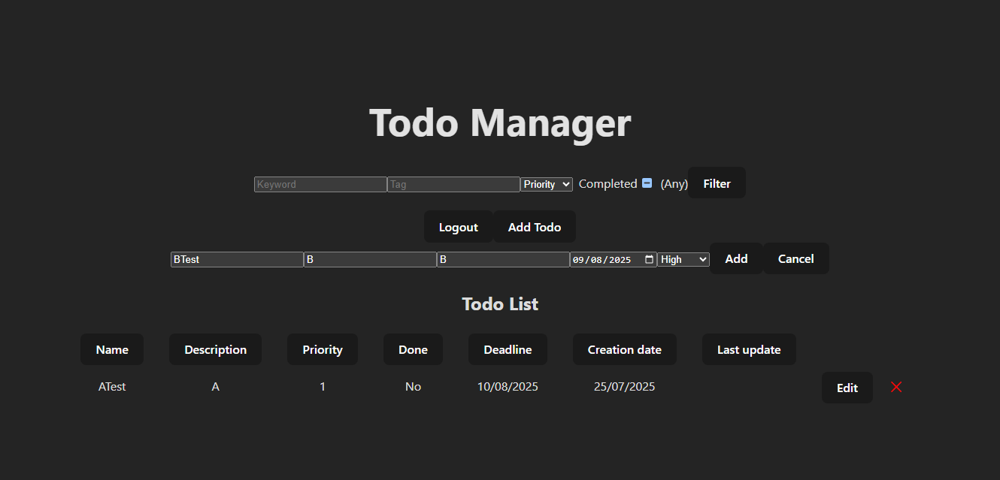
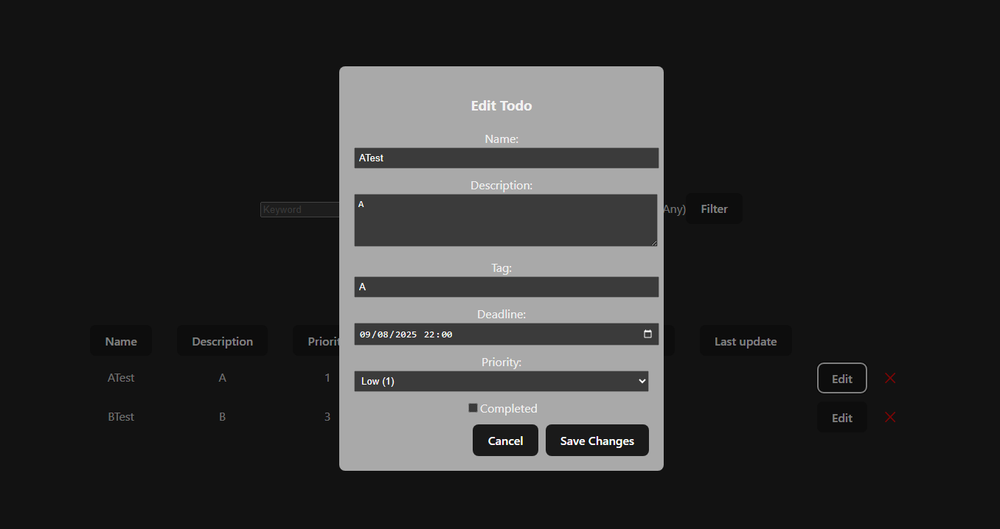

# TodoReact

A full-stack to-do list web application built with **ASP.NET Core (.NET 8)** for the backend and **React + TypeScript** for the frontend.
- *This is my first full-stack project using .NET and React.*

---

## Features

- User authentication and registration
- Create, edit, delete, and filter to-do items
- Priority, tags, and completion status
- Entity Framework Core for data access
- Swagger API documentation

## Tech Stack

- **Backend:** ASP.NET Core (.NET 8), Entity Framework Core, SQL Server
- **Frontend:** React, TypeScript, Vite
- **Authentication:** ASP.NET Core Identity, JWT
- **Tooling:** Visual Studio 2022

## Screenshots

---

